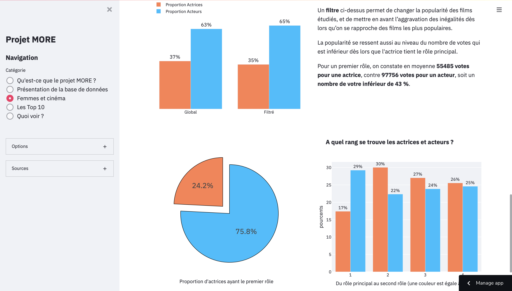

# Projet MORE
_Creation d’un WebApp de recommandation de films_

## Sommaire

* [Origine du projet](#origine-du-projet)
* [Screenshots](#interface)
* [Technologies](#technologies)
* [Bases de Données](#bases-de-données)
* [Status](#status)
* [La Team](#la-team)

## Origine du projet

Le _Projet MORE_ est né lors d’un projet d’école organisé par la __Wild Code School__

L’objectif de fournir les outils d’analyse d’une base de données de films, fournie par __IMDB__ et s’articule autour de 4 thèmes :
- Une rapide présentation de la base de données 
- Une étude de la place de la femme dans le cinéma
- différents TOP10 par années et genre. 
- L’entrainement d’outils de Machine Learning : 
	* Recommandation de films proches d’un film cible grâce à un modèle de __KNN__
	* proposition d’une rétrospective avec un modèle de __Régression Logistique__
	* la probabilité d’aimer un film selon un profile utilisateur via la __Régression Logique__

## Interface

Ces analyses ont été mise à disposition au travers d’une __WebApp__ créée au travers de la plateforme __Streamlit__.

### Adresse du site :

Le site est hébergé directement sur les serveurs mis à disposition par *Streamlit* :

https://share.streamlit.io/mickaelkohler/projet_more/main

### Captures d’écran

   
   

## Technologies 

Projet fait entièrement en **Python**

Utilisations des librairies suivantes : 
	*Pandas
	*Sklearn
	*Plotly
	*BeautifulSoup
	*Streamlit

## Bases de données 

Les [bases de données de **IMDB**](https://www.imdb.com/interfaces/) ont été utilisées pour établir les statistiques.

Un scraping de la [page **Wikipedia** de Netflix](https://en.wikipedia.org/wiki/Lists_of_Netflix_original_films) a été fait pour identifier les films Netflix. 

## Status

Projet clôture et présenté le *07/04/2021*.

## La Team

Le projet a été réalisé par les élèves de la **Wild Code School** : 
	*Ahlem Touati
	*Fanyim Dingue
	*Michael Kohler
	*[Raphaël Da Silva](https://github.com/raphadasilva)
	*Soufiane Imadanayen 
